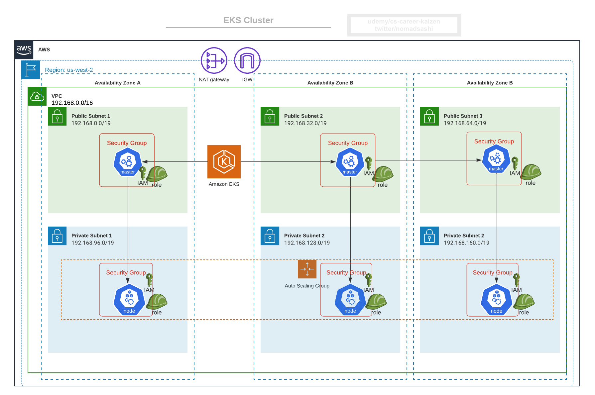

# EKS

## 1.0 Creating the EKS Cluster

Creating the EKS Cluster with 1 node and max 2 just to try out some features.

```bash
eksctl create cluster \
    --name eks-from-eksctl \
    --version 1.16 \
    --region us-east-1 \
    --nodegroup-name workers \
    --node-type t3.medium \
    --nodes 1 \
    --nodes-min 1 \
    --nodes-max 2 \
    --ssh-access \
    --ssh-public-key ~/.ssh/id_rsa.pub \
    --managed
2021-03-21 10:30:37 [ℹ]  eksctl version 0.41.0
2021-03-21 10:30:37 [ℹ]  using region us-east-1
2021-03-21 10:30:38 [ℹ]  setting availability zones to [us-east-1b us-east-1a]
2021-03-21 10:30:38 [ℹ]  subnets for us-east-1b - public:192.168.0.0/19 private:192.168.64.0/19
2021-03-21 10:30:38 [ℹ]  subnets for us-east-1a - public:192.168.32.0/19 private:192.168.96.0/19
2021-03-21 10:30:38 [ℹ]  using SSH public key "/Users/douglas/.ssh/id_rsa.pub" as "eksctl-eks-from-eksctl-nodegroup-workers-ce:80:ba:8a:97:a3:34:61:cc:44:15:18:43:d0:ef:9c"
2021-03-21 10:30:39 [ℹ]  using Kubernetes version 1.16
2021-03-21 10:30:39 [ℹ]  creating EKS cluster "eks-from-eksctl" in "us-east-1" region with managed nodes
2021-03-21 10:30:39 [ℹ]  will create 2 separate CloudFormation stacks for cluster itself and the initial managed nodegroup
2021-03-21 10:30:39 [ℹ]  if you encounter any issues, check CloudFormation console or try 'eksctl utils describe-stacks --region=us-east-1 --cluster=eks-from-eksctl'
2021-03-21 10:30:39 [ℹ]  CloudWatch logging will not be enabled for cluster "eks-from-eksctl" in "us-east-1"
2021-03-21 10:30:39 [ℹ]  you can enable it with 'eksctl utils update-cluster-logging --enable-types={SPECIFY-YOUR-LOG-TYPES-HERE (e.g. all)} --region=us-east-1 --cluster=eks-from-eksctl'
2021-03-21 10:30:39 [ℹ]  Kubernetes API endpoint access will use default of {publicAccess=true, privateAccess=false} for cluster "eks-from-eksctl" in "us-east-1"
2021-03-21 10:30:39 [ℹ]  2 sequential tasks: { create cluster control plane "eks-from-eksctl", 2 sequential sub-tasks: { wait for control plane to become ready, create managed nodegroup "workers" } }
2021-03-21 10:30:39 [ℹ]  building cluster stack "eksctl-eks-from-eksctl-cluster"
2021-03-21 10:30:40 [ℹ]  deploying stack "eksctl-eks-from-eksctl-cluster"
2021-03-21 10:31:10 [ℹ]  waiting for CloudFormation stack "eksctl-eks-from-eksctl-cluster"
2021-03-21 10:31:41 [ℹ]  waiting for CloudFormation stack "eksctl-eks-from-eksctl-cluster"
2021-03-21 10:32:42 [ℹ]  waiting for CloudFormation stack "eksctl-eks-from-eksctl-cluster"
2021-03-21 10:33:43 [ℹ]  waiting for CloudFormation stack "eksctl-eks-from-eksctl-cluster"
2021-03-21 10:34:44 [ℹ]  waiting for CloudFormation stack "eksctl-eks-from-eksctl-cluster"
2021-03-21 10:35:44 [ℹ]  waiting for CloudFormation stack "eksctl-eks-from-eksctl-cluster"
2021-03-21 10:36:45 [ℹ]  waiting for CloudFormation stack "eksctl-eks-from-eksctl-cluster"
2021-03-21 10:37:46 [ℹ]  waiting for CloudFormation stack "eksctl-eks-from-eksctl-cluster"
2021-03-21 10:38:46 [ℹ]  waiting for CloudFormation stack "eksctl-eks-from-eksctl-cluster"
2021-03-21 10:39:47 [ℹ]  waiting for CloudFormation stack "eksctl-eks-from-eksctl-cluster"
2021-03-21 10:40:48 [ℹ]  waiting for CloudFormation stack "eksctl-eks-from-eksctl-cluster"
2021-03-21 10:41:49 [ℹ]  waiting for CloudFormation stack "eksctl-eks-from-eksctl-cluster"
2021-03-21 10:42:07 [ℹ]  building managed nodegroup stack "eksctl-eks-from-eksctl-nodegroup-workers"
2021-03-21 10:42:08 [ℹ]  deploying stack "eksctl-eks-from-eksctl-nodegroup-workers"
2021-03-21 10:42:08 [ℹ]  waiting for CloudFormation stack "eksctl-eks-from-eksctl-nodegroup-workers"
2021-03-21 10:42:25 [ℹ]  waiting for CloudFormation stack "eksctl-eks-from-eksctl-nodegroup-workers"
2021-03-21 10:42:42 [ℹ]  waiting for CloudFormation stack "eksctl-eks-from-eksctl-nodegroup-workers"
2021-03-21 10:43:03 [ℹ]  waiting for CloudFormation stack "eksctl-eks-from-eksctl-nodegroup-workers"
2021-03-21 10:43:20 [ℹ]  waiting for CloudFormation stack "eksctl-eks-from-eksctl-nodegroup-workers"
2021-03-21 10:43:41 [ℹ]  waiting for CloudFormation stack "eksctl-eks-from-eksctl-nodegroup-workers"
2021-03-21 10:44:01 [ℹ]  waiting for CloudFormation stack "eksctl-eks-from-eksctl-nodegroup-workers"
2021-03-21 10:44:20 [ℹ]  waiting for CloudFormation stack "eksctl-eks-from-eksctl-nodegroup-workers"
2021-03-21 10:44:38 [ℹ]  waiting for CloudFormation stack "eksctl-eks-from-eksctl-nodegroup-workers"
2021-03-21 10:44:56 [ℹ]  waiting for CloudFormation stack "eksctl-eks-from-eksctl-nodegroup-workers"
2021-03-21 10:45:14 [ℹ]  waiting for CloudFormation stack "eksctl-eks-from-eksctl-nodegroup-workers"
2021-03-21 10:45:31 [ℹ]  waiting for CloudFormation stack "eksctl-eks-from-eksctl-nodegroup-workers"
2021-03-21 10:45:32 [ℹ]  waiting for the control plane availability...
2021-03-21 10:45:32 [✔]  saved kubeconfig as "/Users/douglas/.kube/config"
2021-03-21 10:45:32 [ℹ]  no tasks
2021-03-21 10:45:32 [✔]  all EKS cluster resources for "eks-from-eksctl" have been created
2021-03-21 10:45:33 [ℹ]  nodegroup "workers" has 1 node(s)
2021-03-21 10:45:33 [ℹ]  node "ip-192-168-48-247.ec2.internal" is ready
2021-03-21 10:45:33 [ℹ]  waiting for at least 1 node(s) to become ready in "workers"
2021-03-21 10:45:33 [ℹ]  nodegroup "workers" has 1 node(s)
2021-03-21 10:45:33 [ℹ]  node "ip-192-168-48-247.ec2.internal" is ready
2021-03-21 10:45:34 [ℹ]  kubectl command should work with "/Users/douglas/.kube/config", try 'kubectl get nodes'
2021-03-21 10:45:34 [✔]  EKS cluster "eks-from-eksctl" in "us-east-1" region is ready
```

Once you have created a cluster, you will find that cluster credentials were added in ~/.kube/config

You can double check the merged kubeconfig settings with the following command line.

```bash
kubectl config view
apiVersion: v1
clusters:
- cluster:
    certificate-authority-data: DATA+OMITTED
    server: https://kubernetes.docker.internal:6443
  name: docker-desktop
- cluster:
    certificate-authority-data: DATA+OMITTED
    server: https://xxx.gr7.us-east-1.eks.amazonaws.com
  name: eks-from-eksctl.us-east-1.eksctl.io
...
```

Now we can double check the contexts

```bash
kubectl config get-contexts
CURRENT   NAME                                          CLUSTER                               AUTHINFO                                      NAMESPACE
          docker-desktop                                docker-desktop                        docker-desktop
*         douglas@eks-from-eksctl.us-east-1.eksctl.io   eks-from-eksctl.us-east-1.eksctl.io   douglas@eks-from-eksctl.us-east-1.eksctl.io
```

If you are not in the correct context we can switch with the following command line.,

```bash
kubectl config use-context douglas@eks-from-eksctl.us-east-1.eksctl.io
Switched to context "douglas@eks-from-eksctl.us-east-1.eksctl.io".
```

If you are get used to OpenShift you can use the following command line to simulate the oc project command, it will permanently save the namespace for all subsequent kubectl commands in that context.

```bash
kubectl config set-context --current --namespace=mynamespace
```

Get info about cluster resources

```bash
aws eks describe-cluster --name eks-from-eksctl --region us-east-1
{
    "cluster": {
        "name": "eks-from-eksctl",
        "arn": "arn:aws:eks:us-east-1:xxxxxxxxxx:cluster/eks-from-eksctl",
        "createdAt": "2021-03-22T18:43:39.254000-03:00",
        "version": "1.16",
        "endpoint": "https://xxxxxxxxxx.gr7.us-east-1.eks.amazonaws.com",
        "roleArn": "arn:aws:iam::xxxxxxxxxx:role/eksctl-eks-from-eksctl-cluster-ServiceRole-XXXXXX",
        "resourcesVpcConfig": {
            "subnetIds": [
                "subnet-0f7d6fxxxxx",
                "subnet-0900ebxxxxx",
                "subnet-0930bdxxxxx",
                "subnet-00b31bxxxxx"
            ],
            "securityGroupIds": [
                "sg-0f118630xxxxx"
            ],
```

Output shows the default `kubernetes` service, which is the API server in master node

```bash
kubectl get svc
NAME         TYPE        CLUSTER-IP   EXTERNAL-IP   PORT(S)   AGE
kubernetes   ClusterIP   10.100.0.1   <none>        443/TCP   19m
```

## 1.1 AWS Networking Basics Overview - Region, AZ, VPC and Subnet



Master (AWS manages this, hence master nodes not visible in Console):

- three master nodes for HA
- security group for masters
- IAM role and instance profile for master nodes

Worker:

- arbitrary # of worker nodes
- auto scaling group (ASG)
- launch config for ASG (launch config is a template for ASG)
- security group for workers
- IAM role and instance profile for workers

AWS VPC:

- VPC
- Subnets for three availability zones (AZ) for us-west-2 region
- Route tables with routes
- Internet Gateway
- NAT gateway

## 1.2 Install Helm v3

Let's install the helm command line into MacOS if you are using another OS please double check: [Helm](https://helm.sh/docs/intro/install/)

```bash
brew install helm
```

After install the helm let's double check if the binary is working properly

```bash
helm version
version.BuildInfo{Version:"v3.5.3", GitCommit:"041ce5a2c17a58be0fcd5f5e16fb3e7e95fea622", GitTreeState:"dirty", GoVersion:"go1.16"}
```

Let's install the popular helm repositories

```bash
helm repo add "stable" "https://charts.helm.sh/stable"
helm repo add bitnami https://charts.bitnami.com/bitnami
```

Now let's list the repositories

```bash
helm repo list
NAME         	URL
stable       	https://charts.helm.sh/stable
bitnami      	https://charts.bitnami.com/bitnami
```

Now we need to update the repositories

```bash
helm repo update
Hang tight while we grab the latest from your chart repositories...
...Successfully got an update from the "stable" chart repository
...Successfully got an update from the "bitnami" chart repository
Update Complete. ⎈Happy Helming!⎈
```

## 1.3 Deploy Kuberenetes Dashboard


### 1.3.1 Required setup 1: Install Metrics Server first so Dashboard can poll metrics

- [Metrics Server](https://github.com/kubernetes-sigs/metrics-server)

```bash
kubectl apply -f https://github.com/kubernetes-sigs/metrics-server/releases/latest/download/components.yaml
serviceaccount/metrics-server created
clusterrole.rbac.authorization.k8s.io/system:aggregated-metrics-reader created
clusterrole.rbac.authorization.k8s.io/system:metrics-server created
rolebinding.rbac.authorization.k8s.io/metrics-server-auth-reader created
clusterrolebinding.rbac.authorization.k8s.io/metrics-server:system:auth-delegator created
clusterrolebinding.rbac.authorization.k8s.io/system:metrics-server created
service/metrics-server created
deployment.apps/metrics-server created
apiservice.apiregistration.k8s.io/v1beta1.metrics.k8s.io created
```

Check metrics-server deployment

```bash
kubectl get deployment metrics-server -n kube-system
NAME             READY   UP-TO-DATE   AVAILABLE   AGE
metrics-server   1/1     1            1           58s
```

### 1.3.2 Required setup 2: Install Dashboard v2.2.0

- [Kubernetes Dashboard](https://github.com/kubernetes/dashboard)
- [Tutorial: Deploy the Kubernetes Dashboard (web UI)](https://docs.aws.amazon.com/eks/latest/userguide/dashboard-tutorial.html)

```bash
kubectl apply -f https://raw.githubusercontent.com/kubernetes/dashboard/v2.2.0/aio/deploy/recommended.yaml
namespace/kubernetes-dashboard created
serviceaccount/kubernetes-dashboard created
service/kubernetes-dashboard created
secret/kubernetes-dashboard-certs created
secret/kubernetes-dashboard-csrf created
secret/kubernetes-dashboard-key-holder created
configmap/kubernetes-dashboard-settings created
role.rbac.authorization.k8s.io/kubernetes-dashboard created
clusterrole.rbac.authorization.k8s.io/kubernetes-dashboard created
rolebinding.rbac.authorization.k8s.io/kubernetes-dashboard created
clusterrolebinding.rbac.authorization.k8s.io/kubernetes-dashboard created
deployment.apps/kubernetes-dashboard created
service/dashboard-metrics-scraper created
deployment.apps/dashboard-metrics-scraper created
```

### 1.3.3 Required setup 3: Create RBAC to control what metrics can be visible

[eks-admin-service-account.yaml](eks-admin-service-account.yaml)

```yaml
apiVersion: v1
kind: ServiceAccount
metadata:
  name: eks-admin
  namespace: kube-system
---
apiVersion: rbac.authorization.k8s.io/v1beta1
kind: ClusterRoleBinding
metadata:
  name: eks-admin
roleRef:
  apiGroup: rbac.authorization.k8s.io
  kind: ClusterRole
  name: cluster-admin
subjects:
- kind: ServiceAccount
  name: eks-admin
  namespace: kube-system
```

Creating the new service account.

```bash
kubectl apply -f eks-admin-service-account.yaml
serviceaccount/eks-admin created
clusterrolebinding.rbac.authorization.k8s.io/eks-admin created
```

Check it created in `kube-system` namespace

```bash
kubectl get sa -n kube-system | grep eks-admin
eks-admin                            1         28s
```

Now we need to get the token from the eks-admin so we can login into the kubernetes dashboard.

```bash
kubectl -n kube-system get secret $(kubectl -n kube-system get secret | grep eks-admin | awk '{print $1}') -o jsonpath='{.data.token}' | base64 -d
eyJhbGciOiJSUzI1NiIsImtpZCI6ImVjZEN4bkZ6Sk1GRmthSV8yXzg3bGR4b21WaWt1bUZKVWEzZVpteHktS3MifQ.eyJpc3MiOiJrdWJlcm5ldGVzL3NlcnZpY2VhY2NvdW50Iiwia3ViZXJuZXRlcy5pby9zZXJ2aWNlYWNjb3VudC9uYW1lc3BhY2UiOiJrdWJlLXN5c3RlbSIsImt1YmVybmV0ZXMuaW8vc2VydmljZWFjY291bnQvc2VjcmV0Lm5hbWUiOiJla3MtYWRtaW4tdG9r...
```

Open a new terminal tab to create the proxy access into the dashboard.

```bash
kubectl proxys
Starting to serve on 127.0.0.1:8001
```

Now access: [Kubernetes Dashboard](http://localhost:8001/api/v1/namespaces/kubernetes-dashboard/services/https:kubernetes-dashboard:/proxy/#/overview)

Select token and past the token we got.

Now dashboard shows full metrics in all namespaces


### 1.3.4 Lens | The Kubernetes IDE

- [Lens | The Kubernetes IDE](https://k8slens.dev/)
- [Lens | The Kubernetes IDE GitHub](https://github.com/lensapp/lens)

### 1.3.5 Uninstall Dashboard

```bash
kubectl delete -f https://raw.githubusercontent.com/kubernetes/dashboard/v2.2.0/aio/deploy/recommended.yaml
kubectl delete -f eks-admin-service-account.yaml
```

## 2.0 Deleting the EKS Cluster

```bash
eksctl delete cluster --name eks-from-eksctl --region us-east-1
```
